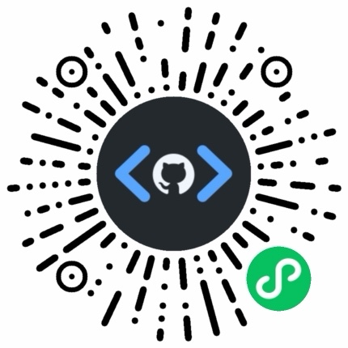

# wechat-reports

> 在微信里跟 AI 对话生成网页，再用小程序在微信里直接阅读——**生成和查看全程不出微信**。

**微信发消息 → AI 写好 HTML 报告并自动 push → 「GH HTML 查看器」小程序里打开。**

比如发一句「帮我规划 3 天东京行程」或「把这些笔记整理成一页」，AI 就在 `reports/` 下生成一个自包含的 `.html` 并自动 commit、push；几秒后你就能在「GH HTML 查看器」小程序里打开它，直接读到排好版的行程或笔记。

**能用来做什么**

- **一次性报告**（`main` 分支）：行程规划、攻略、读书笔记，随用随生成。
- **个人知识库 / LLM Wiki**（`llm-wiki` 分支）：持续积累、互相链接的 HTML 笔记——相当于一个**免费的 Obsidian 多端同步**。

## 怎么用

1. **Clone 这个仓库**，建议 push 到你自己的 GitHub 账号并设为 **private**，这样报告不会公开。
2. **把微信和 AI agent 连起来**，让 agent「在这个仓库里」工作——这样生成和查看都在微信里完成。两种连接方式：

   - **[wechat-acp](https://github.com/formulahendry/wechat-acp)**（推荐，体验最佳）：把微信和本机的 AI agent 连起来，`--cwd` 指向你 clone 下来的这个仓库：

     ```
     npx -y wechat-acp@latest --agent copilot --cwd <你clone的仓库路径>
     ```

     首次运行会在终端显示二维码，用微信扫码登录。

   - **[微信 OpenClaw](https://docs.openclaw.ai/zh-CN/channels/wechat)**：通过腾讯的 `@tencent-weixin/openclaw-weixin` 渠道插件把微信接到 OpenClaw 的 agent，并把工作目录指向这个仓库；同样在微信里扫码登录后发消息即可，获得微信内的生成与查看体验。

   其他工具（Claude Code、Codex、Cursor、GitHub Copilot 等）也可以直接在电脑上用来往这个仓库写报告；但要获得微信内的生成与查看体验，建议通过 wechat-acp 连接。
3. 在微信里给 bot 发消息让它写报告，例如「帮我规划 3 天东京行程」。它会按 [AGENTS.md](AGENTS.md) 在 `reports/` 下生成 HTML 并自动 commit、push。
4. 在「GH HTML 查看器」小程序里指向这个仓库，打开 `reports/` 下的报告。

   

   小程序需要一个 **GitHub Fine-grained PAT** 才能访问仓库（尤其是 private 仓库）。小程序是纯前端应用，token 只存储在当前设备本地，不会上传到任何服务器。生成步骤：
   - 登录 GitHub → 右上角头像 → **Settings** → 左侧 **Developer settings** → **Personal access tokens** → **Fine-grained tokens**
   - 点 **Generate new token**，**Resource owner** 选自己，**Repository access** 选「Only select repositories」并选中这个仓库，**Permissions** 里把 **Contents** 设为 `Read-only`，设好有效期，生成后**立即复制**（只显示一次）。
   - 在小程序设置里粘贴这个 token 即可。

## 工作原理

- **[AGENTS.md](AGENTS.md)** 告诉 AI 怎么写报告。
- **[.claude/skills/mp-html-page/SKILL.md](.claude/skills/mp-html-page/SKILL.md)** 是让 HTML 留在小程序 [mp-html](https://github.com/jin-yufeng/mp-html) 组件 `style` 插件能力范围内的技能，保证浏览器和小程序里都能正确显示。它是项目级技能，所以这个仓库里的 Claude / Copilot 助手会自动加载。
- **`reports/`** 存放生成的页面。[reports/gallery.html](reports/gallery.html) 是一个**案例合集**（东京行程、天津攻略、AI 速览、世界杯战报等，都可以在小程序里点开）；单看一个示例可参考 [reports/tokyo-3-day-trip.html](reports/tokyo-3-day-trip.html)。

## 作为个人知识库（LLM Wiki）

`main` 分支适合写**一次性报告**；想把仓库当成**持续积累的个人知识库**，就切到 **`llm-wiki` 分支**，按那边的 [AGENTS.md](https://github.com/duzitong/wechat-reports/blob/llm-wiki/AGENTS.md) 配置。它沿用 [Karpathy 的 LLM Wiki 模式](https://gist.github.com/karpathy/442a6bf555914893e9891c11519de94f)：你往 `raw/` 丢原始资料（文章、笔记、PDF、图片），AI 读完后在 `wiki/` 里维护一套互相链接的页面，并随每条新资料更新索引、交叉引用和日志。区别在于 `wiki/` 里的页面是用 mp-html-page 技能生成的 **HTML**（而不是原版的 Markdown），同样能在「GH HTML 查看器」小程序里直接浏览——配上 Git 同步，相当于一个**免费的 Obsidian 多端同步**，省掉订阅费，还能让 AI 直接帮你维护内容。
